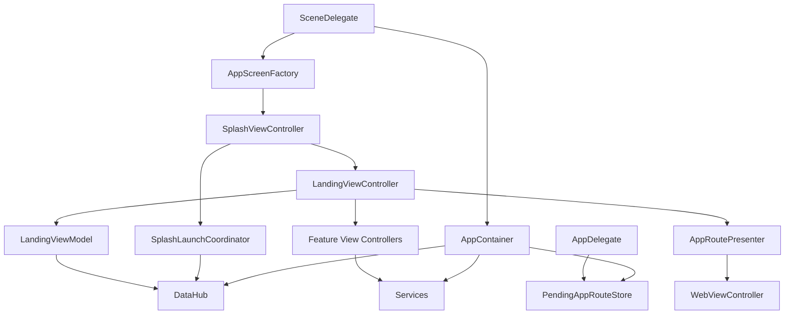

# myUBC Design

## Overview

myUBC uses a pragmatic layered design rather than a strict “clean architecture” implementation.

The current structure is centered around:

- a small application shell for startup, dependency injection, and cross-feature routing
- feature services that own networking, parsing, caching, and error mapping
- lightweight view models for screens that benefit from separating data loading from UIKit rendering
- UIKit view controllers that still own most presentation and interaction logic

The main goal of the current design is to keep feature code understandable and testable without forcing a complete rewrite of the app into an abstract architecture that would be heavier than the product needs.

## Design Goals

The current design is trying to address a few concrete problems that existed in earlier iterations of the app:

- app startup was driven by timers and ad hoc controller behavior instead of explicit startup state
- notification-driven navigation leaked feature construction into `AppDelegate`
- web navigation policy was controlled by ambiguous booleans instead of a typed model
- landing-page data orchestration lived directly inside a very large collection view controller
- network and parsing logic were too close to controllers, which made testing and recovery behavior harder

The design does not try to solve every architectural concern at once. It focuses on making the highest-risk flows explicit, typed, and testable first.

## Principles And Influences

The implementation is inspired by a combination of:

- dependency injection through a shared application container
- coordinator/router ideas for app-level navigation decisions
- MVVM-style view models for feature data loading and presentation state
- service-oriented boundaries for external integrations
- structured concurrency and actor isolation for shared async state

This is not a pure coordinator architecture, and it is not a pure MVVM app. The choice here is intentional. The app keeps UIKit controllers as the rendering layer, but moves stateful orchestration out when that orchestration starts to create coupling or testing problems. The runtime shell is now programmatic; the app no longer depends on `Main.storyboard` for startup or navigation.

## High-Level Architecture

## Application Shell

### `AppContainer`

[`myUBC/Core/App/AppContainer.swift`](myUBC/Core/App/AppContainer.swift)

`AppContainer` is the composition root for app-level dependencies.

It creates and owns:

- `NetworkClient`
- `CacheStore`
- all feature services
- `DataHub`
- `SanityCheckService`
- `PendingAppRouteStore`

Why this exists:

- controllers should not decide how to construct services
- app-wide singletons should be explicit rather than hidden behind static globals
- tests need a place where dependencies can be replaced predictably

Why this solves the earlier problem:

- it prevents features from constructing their own service stacks ad hoc
- it makes dependency flow visible from one place
- it lets the app introduce new app-shell services, like route storage, without threading more static state through the codebase

### `AppScreenFactory`

[`myUBC/Core/App/AppScreenFactory.swift`](myUBC/Core/App/AppScreenFactory.swift)

`AppScreenFactory` owns the remaining app-shell screen construction that needs explicit typed setup.

Why this exists:

- startup is now programmatic rather than storyboard-driven
- cross-feature presentation should not depend on string-based storyboard identifiers
- screens such as splash, charger, bulletin, and legal flows require typed construction

Why this solves the earlier problem:

- application boot now reads as normal UIKit code instead of storyboard indirection
- navigation setup can inject dependencies and preloaded state directly
- presentation paths are visible in code review and easier to test

## Startup Coordination

### `SplashLaunchCoordinator`

[`myUBC/Core/App/SplashLaunchCoordinator.swift`](myUBC/Core/App/SplashLaunchCoordinator.swift)

Startup now uses an explicit coordinator function instead of a fixed `Timer`.

The coordinator does two things in parallel:

- waits for `DataHub.refreshAll()`
- waits for a timeout

It also enforces a minimum splash duration so the splash screen still behaves like a deliberate launch screen instead of a flash.

Why this exists:

- startup completion should be based on state, not just elapsed time
- the app still needs a bounded launch path when upstream services are slow
- this logic should be testable without spinning up real controllers

Why this solves the earlier problem:

- it makes the startup contract explicit: “show landing after data is ready or the startup timeout expires”
- it removes view-controller-owned timing state
- it allows direct unit testing of timeout and success behavior

### `SplashViewController`

[`myUBC/Features/Splash/SplashViewController.swift`](myUBC/Features/Splash/SplashViewController.swift)

`SplashViewController` now does only three meaningful things:

- render and animate the splash UI
- call the startup coordinator
- present the landing screen once startup is complete

Its UI is now built in code, which removes the last storyboard dependency from the launch path.

This is an example of the broader rule used in the refactor: controllers may still own UIKit behavior, but long-lived orchestration should move out when it becomes stateful or cross-cutting.

## Routing And Navigation Policy

### `AppRoute`, `PendingAppRouteStore`, and `AppRoutePresenter`

[`myUBC/Core/App/AppRoute.swift`](myUBC/Core/App/AppRoute.swift)

The routing layer is intentionally small.

`AppRoute` is a typed description of cross-feature destinations.

`PendingAppRouteStore` is an actor-backed handoff point for routes that are discovered before the target UI is ready.

`AppRoutePresenter` converts a route into concrete UIKit presentation.

This is coordinator-inspired, but deliberately minimal. It is not a large navigation framework.

Why this exists:

- `AppDelegate` and notification callbacks should not construct feature controller trees directly
- app-level events can arrive before a screen is ready to present
- route intent should be decoupled from presentation timing

Why this solves the earlier problem:

- `AppDelegate` now records or triggers a route instead of knowing feature-specific presentation chains
- the app can defer route consumption until a visible screen is ready
- route behavior becomes typed and testable instead of closure-based and implicit
- route presentation no longer depends on storyboard identifiers or segue wiring

### `WebNavigationPolicy` and `WebViewConfiguration`

Earlier code used two booleans to describe web behavior:

- whether navigation was unrestricted
- whether interaction should be blocked

That created invalid or unclear state combinations.

The current design replaces that with:

- `WebNavigationPolicy`
- `WebViewConfiguration`

This converts policy from “flags on a controller” into “a configuration object describing the intended behavior”.

Why this exists:

- boolean combinations are easy to misuse and hard to reason about
- web presentation is effectively a reusable feature with different trust levels
- navigation restrictions and interaction restrictions are policy, not controller mood

Why this solves the earlier problem:

- the valid modes are finite and named
- call sites become self-describing, for example `upassRenewal()` or `ubcReadOnly(url:)`
- the `WebViewController` can stay generic while behavior stays explicit

## Data Loading Layer

### Services

The app’s services are responsible for:

- fetching remote data
- parsing source payloads
- caching
- fallback to cached values when appropriate
- mapping failures into `AppError`

Examples include:

- `FoodService`
- `LibraryService`
- `InfoService`
- `ParkingService`
- `CalendarService`

This is the main place where the code follows separation-of-concerns most consistently.

Why this exists:

- controllers should not own network requests or parsing rules
- caching behavior should be consistent within a feature
- errors should be mapped once near the boundary rather than differently in each controller

Why this solves the earlier problem:

- feature screens can load data through a stable protocol boundary
- parser and service behavior can be tested without UI
- cache fallback becomes part of the service contract rather than screen-specific rescue logic

### `DataHub`

[`myUBC/Core/Data/DataHub.swift`](myUBC/Core/Data/DataHub.swift)

`DataHub` is an actor that aggregates feature services for the landing page.

Its responsibilities are:

- load the landing snapshot in parallel
- deduplicate concurrent snapshot requests with `inFlightSnapshotTask`
- summarize feature availability during startup

This is intentionally not a generic repository abstraction. It is a specific orchestration object for a real app use case: “give the landing screen one coherent snapshot”.

Why this exists:

- the landing screen depends on several feature modules at once
- concurrent requests to build the landing screen should not trigger duplicate network work
- feature aggregation belongs above individual services but below the UI

Why this solves the earlier problem:

- the landing feature no longer has to coordinate five data sources on its own
- startup and landing can share the same aggregated snapshot semantics
- concurrency and deduplication live in one place

## Presentation State

### View Models

The app now uses view models where the controller previously mixed rendering with data orchestration.

Current examples include:

- `LandingViewModel`
- `FoodListViewModel`
- `FoodDetailViewModel`
- `CalendarViewModel`
- `ParkingViewModel`
- `NoticeViewModel`
- `ChargerViewModel`
- `HomeViewModel`
- `FoodListScreenModel`
- `CalendarScreenModel`
- `NoticeScreenState`

This is an intentionally light MVVM approach:

- view models own load operations and screen-level data state
- controllers still own UIKit rendering and interaction wiring
- business rules stay in services or app-shell helpers, not in the view model by default

### `LandingViewModel`

[`myUBC/Features/Landing/ViewModels/LandingViewModel.swift`](myUBC/Features/Landing/ViewModels/LandingViewModel.swift)

`LandingViewModel` exists because the landing screen is a summary screen that composes several features.

It owns:

- landing snapshot loading
- mapping of service results into section data
- section availability/loading state

Why this exists:

- `LandingViewController` had become both renderer and data orchestrator
- landing needs a testable place for section-level success/failure logic
- the controller should not know how to interpret the `DataHub` snapshot in detail

Why this solves the earlier problem:

- the controller becomes closer to a rendering layer
- section state behavior is now unit testable
- the data contract for landing is explicit and reusable

## Notification And Reminder State

The app uses two separate patterns for app-level state depending on the problem:

- `ReminderStateStore` for charger reminder persistence and synchronization with pending notifications
- `PendingAppRouteStore` for deferred route handoff

The principle is the same in both cases:

- shared state should have a single owner
- state should be driven from the real source of truth where possible
- controllers should observe or consume state rather than invent parallel copies

This addresses a previous design weakness where UI flags, notification state, and app delegate callbacks could drift apart.

## UI Construction

The app now uses a mixed UIKit construction strategy:

- application startup and cross-feature presentation are programmatic
- feature screens are instantiated explicitly through factories or direct initializers
- many leaf screens, cells, and reusable views still use XIBs

This is intentional.

Why this exists:

- removing storyboard from the runtime shell makes bootstrapping and navigation explicit
- keeping XIBs for leaf views preserves a productive UIKit workflow without centralizing runtime behavior in Interface Builder

Why this solves the earlier problem:

- there is no hidden storyboard dependency at app launch
- navigation no longer relies on string identifiers defined in a monolithic storyboard
- reusable cell and view layout can still be maintained without inflating controller responsibilities

## Repository Structure

The current repository layout reflects the intended ownership boundaries more clearly than the earlier `Global Resources` and broad `Infrastructure` buckets.

- `Core/App`
  - app lifecycle
  - dependency injection
  - startup coordination
  - typed routing
- `Core/Data`
  - landing aggregation
  - cached values
  - cache policy/store
  - app-wide data error types
- `Core/Networking`
  - HTTP client and retry policy
- `Core/Parsers`
  - HTML/data normalization for upstream UBC sources
- `Core/Services`
  - feature-facing service boundaries
- `Core/TestSupport`
  - app-target helpers used only to launch deterministic UI-test scenarios
- `Shared/UI`
  - reusable UI that is not owned by one feature
- `Shared/Web`
  - reusable web presentation wrapper and policy-driven web flow support
- `Shared/Support`
  - shared constants, logging, and utility extensions
- `Vendor`
  - third-party code intentionally kept outside first-party architecture folders
- `Resources/Persistence`
  - Core Data model and other persistence resources

This structure is meant to answer a simple question: “is this file app shell, shared support, or feature code?” If the answer is unclear, the structure is still too broad.

## Testing Approach

The current test strategy is deliberately split by purpose:

- `myUBCTests`
  - parser tests
  - app-shell/runtime tests
  - pure view model tests
  - deterministic view/cell state tests
- `myUBCUITests`
  - mocked workflow tests driven by launch scenarios

The app no longer relies on pixel-baseline UI snapshots as its primary UI regression strategy. In practice, that approach was too sensitive to simulator rendering and system UI. The current design favors:

- exact behavioral assertions in XCUITest with mocked app state
- deterministic component assertions in unit tests for reusable views/cells

This keeps the UI test surface stable without pretending full-screen image comparison is more reliable than it actually is on this project.

## Why The Current Design Is Defensible

The design is defensible because it is trying to solve concrete failure modes with small, explicit abstractions rather than architecture for its own sake.

In particular:

- app-wide dependencies are centralized
- app-wide navigation decisions are typed
- startup behavior is state-driven
- feature integrations are hidden behind service protocols
- multi-feature composition is handled in `DataHub`
- screen-level mapping is moving into view models
- async shared state is isolated with actors where it matters

## What This Design Is Not

To keep the document honest, there are still limits:

- many UIKit controllers are still large and presentation-heavy
- routing is only partially centralized; most in-app feature navigation is still controller-owned
- the app is not using a pure coordinator tree
- the app is not enforcing a strict domain/use-case/entity layering model
- some screens still mix rendering and feature-specific interaction logic more than ideal

This is intentional for now. The current design aims for a strong practical architecture, not maximal abstraction.

## Tradeoffs

The current approach accepts a few tradeoffs:

- more direct UIKit code remains in controllers in exchange for lower indirection
- `AppContainer` is a central dependency object, which is simple but still a powerful shared object
- `AppRoutePresenter` is small and concrete rather than protocol-heavy, which keeps routing easy to follow at the cost of some abstraction
- view models are state holders and loaders, not full presentation frameworks

These tradeoffs are considered acceptable because they keep the codebase readable for contributors while still addressing the most visible architectural weaknesses.

## Testing Strategy And Architectural Impact

The current architecture is meant to support tests at multiple layers:

- parser tests for HTML and payload extraction
- service tests for cache fallback, retry, and error mapping
- view model tests for screen-level state mapping
- app-shell tests for startup coordination and route behavior
- smoke tests for selected controllers

Recent app-shell-specific tests were added to reinforce this design:

- `AppShellArchitectureTests`
- `LandingViewModelTests`
- `WebRoutingTests`
- `LandingScreenUITests`

The repository structure now mirrors these boundaries more directly:

- `myUBC/Core` for app-shell infrastructure, services, and shared view models
- `myUBC/Features` for feature-owned UIKit code and assets
- `myUBC/Resources` for shared app resources such as `Info.plist`, launch screen, persistence assets, and top-level assets
- `myUBCTests/Core`, `myUBCTests/Features`, and `myUBCTests/Support` for unit-test organization
- `myUBCUITests/Landing` and `myUBCUITests/Support` for deterministic UI coverage
